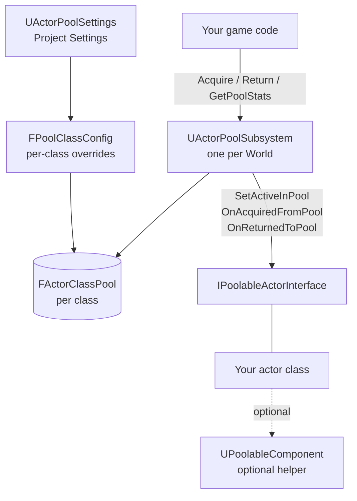
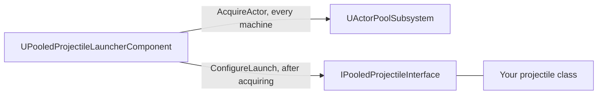

# Architecture

*Copyright (c) 2026 Cody Van De Mark. Licensed under the MIT License. Contact: cody.a.vandemark@gmail.com*

← [README](../README.md) · [Data Flow](DataFlow.md) · [API Reference](API-Reference.md)

This page covers the plugin's pieces and how they relate. For step-by-step call sequences, see [Data Flow](DataFlow.md).

## Components

**Core pooling path** — how configuration, the subsystem, and your actor class relate:



*(`GameCode` also covers `AcquireActorBatch`/`ReturnActorBatch`/`RegisterPoolClass`/`PrewarmPool`; `IFace --- YourActor` means "implemented by".)*

**Projectile launcher path** — the separate route for non-replicated cosmetic actors:



## Parts of the system

### `UActorPoolSubsystem`
A `UWorldSubsystem` — Unreal creates one automatically per `UWorld`, with no actor to place in a level. Because it's world-scoped, **the server and every client each get their own, fully independent instance**; they never call into each other directly (the one partial exception is `bSyncWithReplication` — see [Data Flow](DataFlow.md#replication-sync-flow), which is still only a passive *observation*, never a direct call). It owns a `TMap<TSubclassOf<AActor>, FActorClassPool>` — one entry per class that's actually been used.

### `FActorClassPool`
Internal bookkeeping, not exposed to Blueprint. Two arrays per class:
- `InactiveActors` — treated as a stack (`Pop()`/`Push()` from the end, O(1)).
- `ActiveActorsOrdered` — ordered oldest-acquired (index 0) to newest. This doubles as the recycle queue: when a recyclable pool is exhausted, index 0 is the instance that gets force-recycled.

Plus its own `FPoolClassConfig Config` and a `bHasSpawnedInitialPool` flag (the pool spawns its full `PoolSize` worth of instances exactly once — lazily on first `AcquireActor`, or eagerly if `bPrewarmAtStart` is set).

### `FPoolClassConfig` / `UActorPoolSettings`
`FPoolClassConfig` is the full set of per-class knobs (see [API Reference](API-Reference.md#fpoolclassconfig) for every field). A class gets its config from, in order: an explicit `RegisterPoolClass` call (if made before the pool is first spawned), otherwise a matching entry in `UActorPoolSettings::ClassOverrides`, otherwise the `UActorPoolSettings::DefaultXxx` project-wide fallbacks. `UActorPoolSettings` is a `config`/`defaultconfig` asset, so it ships identically in server and client builds — pool sizes for a given class always agree by default.

### `IPoolableActorInterface`
The one thing every pooled actor must implement (C++ or Blueprint). Four functions, with a strict call-order guarantee the subsystem upholds:

```
Acquire: SetActiveInPool(true)  →  OnAcquiredFromPool()
Return:  OnReturnedToPool()     →  SetActiveInPool(false)
```

i.e. gameplay notifications (`OnAcquiredFromPool`/`OnReturnedToPool`) always run while the actor is mechanically in its "active" state — safe to read transform, run gameplay setup/teardown, etc.

### `UPoolableComponent`
Optional, but what both example classes use. Gives you:
- `DefaultActivate()`/`DefaultDeactivate()` — the boilerplate mechanical activation (unhide / enable collision / enable tick, and the reverse) so `SetActiveInPool_Implementation` can just forward to it.
- A replicated `bActiveInPool` flag with `OnRep_ActiveInPool`, so clients mirror the mechanical state automatically for a replicated actor, and (if `bSyncWithReplication` is on for the class) feed that same signal back into the client's own pool bookkeeping.
- `OnPoolActiveStateChanged`, a Blueprint-assignable delegate that fires on every transition (server or client), handy for hooking up VFX/SFX without subclassing.
- `RequestReturnToPool()` — a server-authority-gated convenience that calls `UActorPoolSubsystem::ReturnActor` for you.

### `UPooledProjectileLauncherComponent` / `IPooledProjectileInterface`
A separate path specifically for **non-replicated** cosmetic actors (`bReplicates = false`), where every machine — server and each client — maintains a fully independent local pool and never synchronizes over the network beyond one triggering RPC. `LaunchProjectile`, called only on the server, acquires the authoritative instance locally and fires an unreliable multicast so every client acquires its own purely-cosmetic copy. `IPooledProjectileInterface::ConfigureLaunch` exists because the launcher is gameplay-agnostic — it has no way to apply per-shot data like initial velocity through `AcquireActor` alone, so it calls this interface function afterward instead.

## Two different pooling situations and two different tools

| | Recyclable/non-recyclable pool | `bSyncWithReplication` | `UPooledProjectileLauncherComponent` |
|---|---|---|---|
| **Use for** | The base case for any pooled class | A *replicated* class, on the pool that doesn't itself call Acquire/Return (typically the client) | A *non-replicated* cosmetic class fired from a weapon |
| **Who spawns instances** | This machine's subsystem | Nobody on this machine — it only observes | Every machine spawns its own, independently |
| **Network cost** | Whatever the actor class normally replicates | None added — piggybacks on the actor's own replication | One unreliable multicast RPC per shot |

See [Data Flow](DataFlow.md) for the exact sequence of calls in each case.
