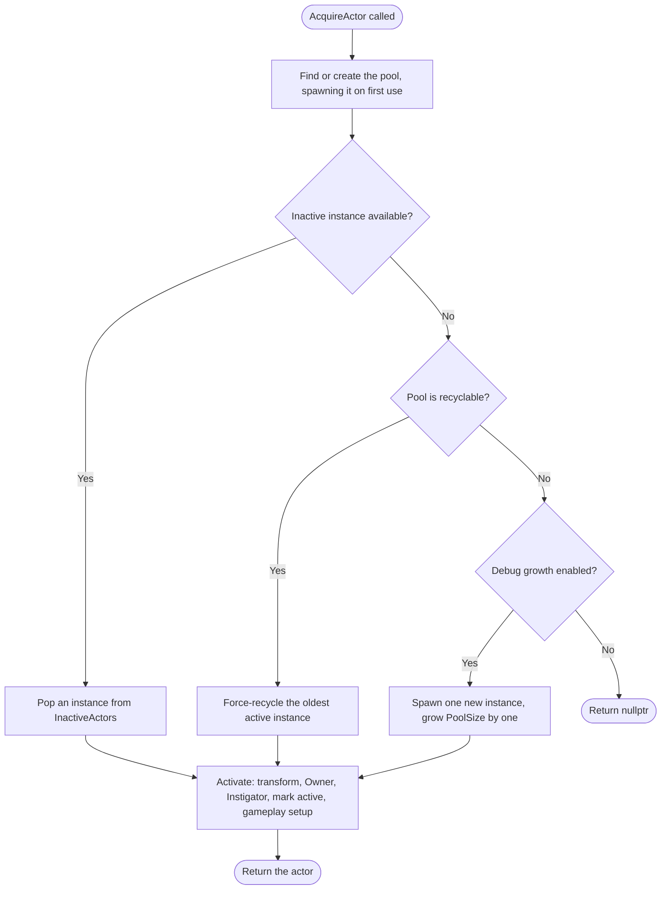
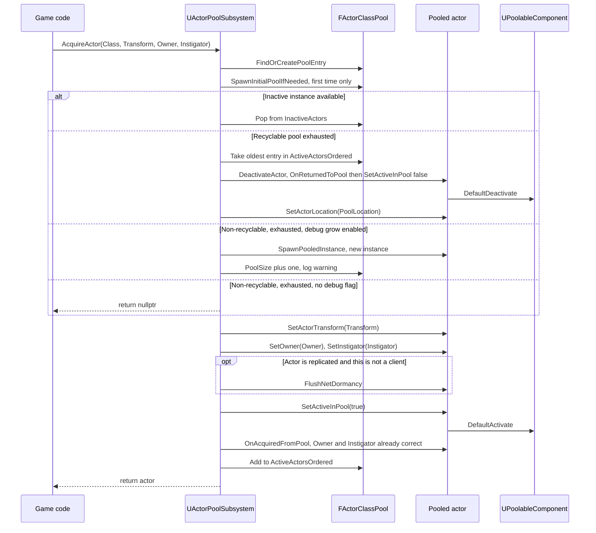
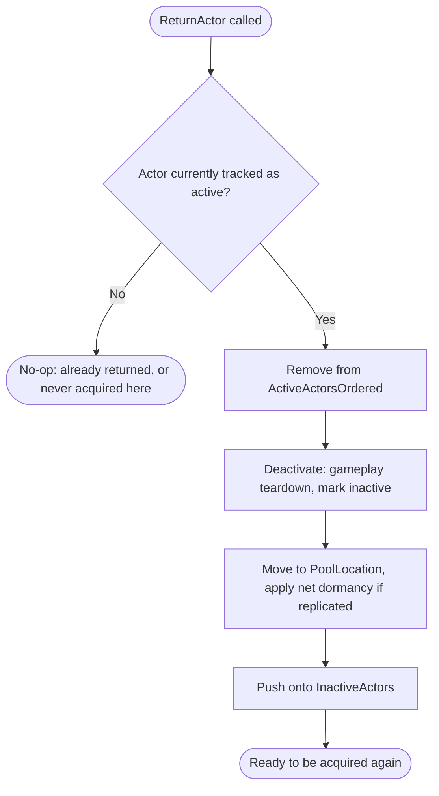
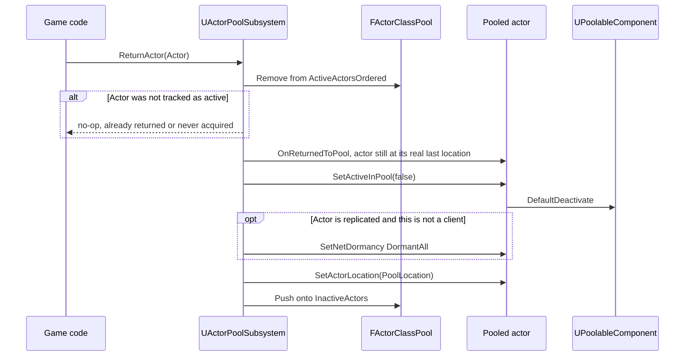
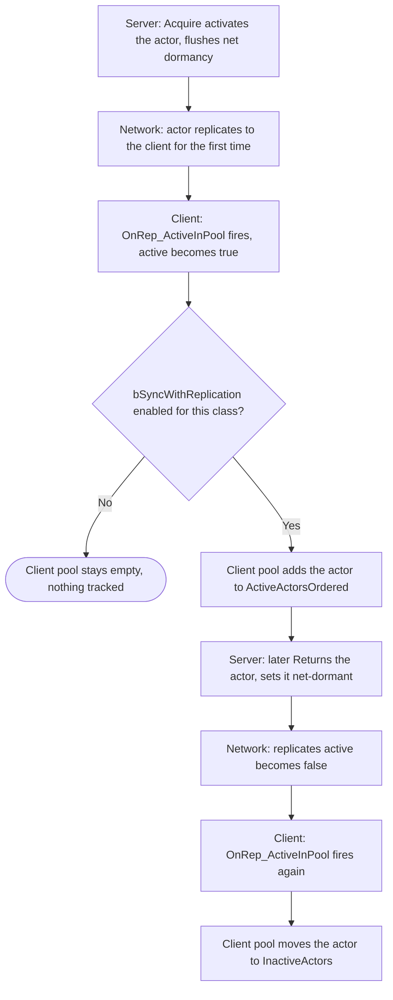
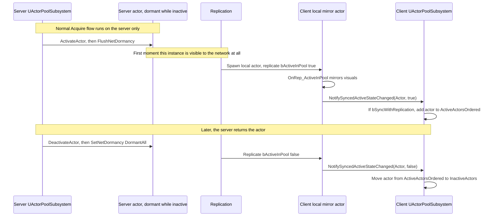
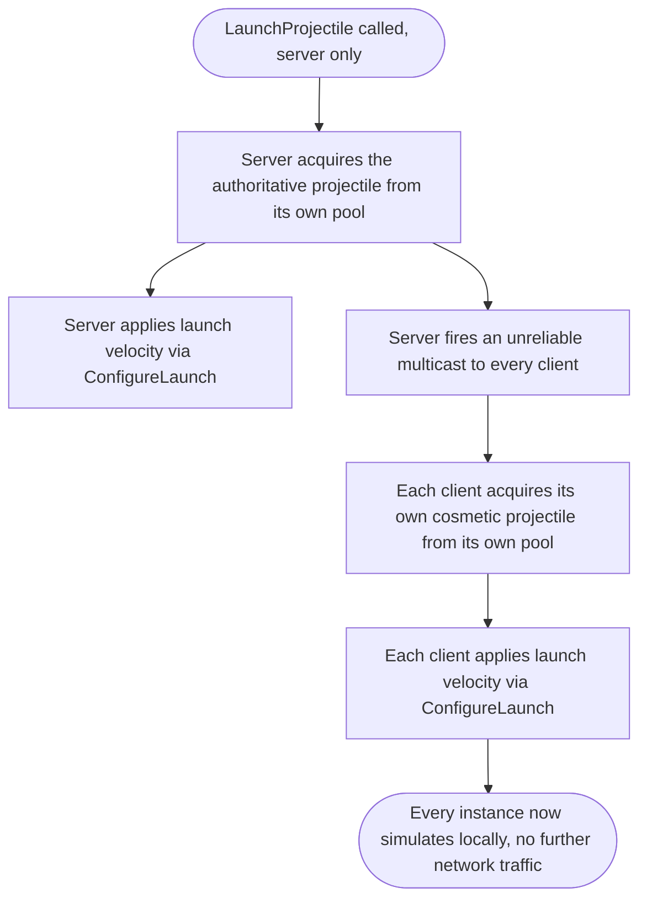
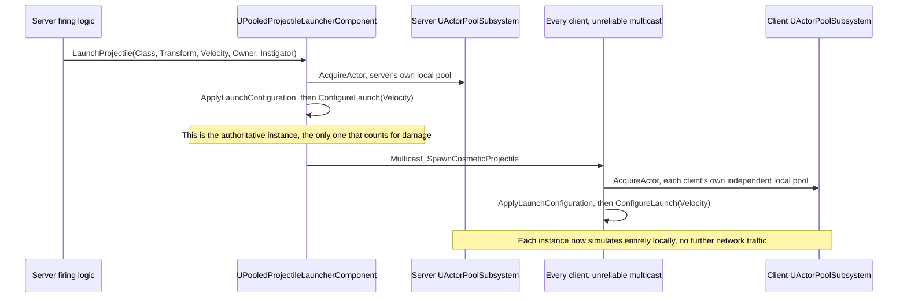

# Data Flow

*Copyright (c) 2026 Cody Van De Mark. Licensed under the MIT License. Contact: cody.a.vandemark@gmail.com*

← [README](../README.md) · [Architecture](Architecture.md) · [API Reference](API-Reference.md)

Four flows cover everything the plugin does. Each one has two views: a **high-level flowchart** for the overall shape of what happens, and a **detailed sequence diagram** underneath showing the exact call path in the current code (not a simplification) — read the first for the gist, the second for precision.

## Acquire flow

`AcquireActor` has three possible outcomes depending on pool state and configuration:

### High-level view

### Detailed sequence

Key ordering guarantees:
- **Owner/Instigator are set before `SetActiveInPool`/`OnAcquiredFromPool` run**, so any gameplay setup code can already read `GetOwner()`/`GetInstigator()`.
- **Mechanical activation runs before the gameplay notification** (`SetActiveInPool(true)` before `OnAcquiredFromPool()`), per `IPoolableActorInterface`'s contract.

`AcquireActorBatch` is just this flow called once per entry in a `SpawnTransforms` array, collecting every non-null result — see [API Reference](API-Reference.md#acquireactorbatch).

## Return flow

### High-level view

### Detailed sequence

The most common entry point for this on a replicated actor is `UPoolableComponent::RequestReturnToPool()`, which gates on `HasAuthority()` before calling `ReturnActor` — so a client can never trigger this directly for a server-authoritative class.

`ReturnActorBatch` just calls this once per entry in an array — `ReturnActor` already no-ops safely on `nullptr` or an untracked actor, so no extra logic is needed.

## Replication sync flow

Only relevant for a class with `FPoolClassConfig::bSyncWithReplication` enabled — normally the *client's* copy of a replicated class's config, since the client never calls `AcquireActor`/`ReturnActor` for such a class itself.

### High-level view

### Detailed sequence

Why this is safe from double-counting: `OnRep_ActiveInPool` only ever fires on a machine that *received* the value over the network — never on the machine that authored the change locally (the server's own `DefaultActivate`/`DefaultDeactivate` set the variable directly and don't trigger their own `OnRep`). So `NotifySyncedActiveStateChanged` can never fire on the same machine that's running the normal Acquire/Return flow above, even if the flag is left on everywhere via shared Project Settings.

Why `GetPoolStats`' `AvailableCount` is derived rather than counted directly for a synced pool: a client only ever learns an instance *exists* the first time it goes active (dormancy withholds it before that), so `InactiveActors` can only ever contain instances that have *already* been active at least once — never a pool member the client hasn't met yet. `GetPoolStats` compensates by reporting `AvailableCount = MaxPoolSize - UnavailableCount` for a synced pool instead of trusting the array size.

Cleanup: if a tracked instance is ever actually destroyed (not just deactivated) — e.g. a client losing relevancy — `HandleActorDestroyed` (hooked to `UWorld`'s actor-destroyed delegate) prunes it from both arrays so stale pointers don't accumulate.

## Non-replicated projectile fan-out flow

For a projectile class with `bReplicates = false`, fired via `UPooledProjectileLauncherComponent`:

### High-level view

### Detailed sequence

Listen-server note: a listen server's own client also receives the multicast. `Multicast_SpawnCosmeticProjectile_Implementation` checks `HasAuthority() && GetNetMode() == NM_ListenServer` and skips, so the host doesn't spawn a redundant second cosmetic copy alongside its authoritative one.
