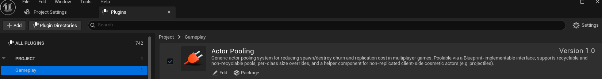
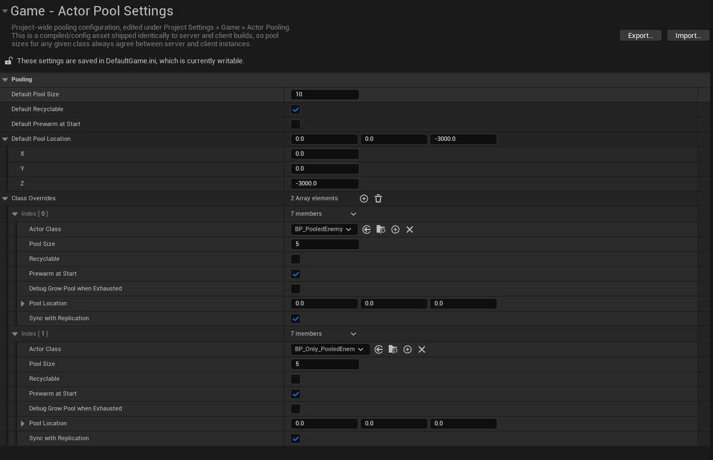
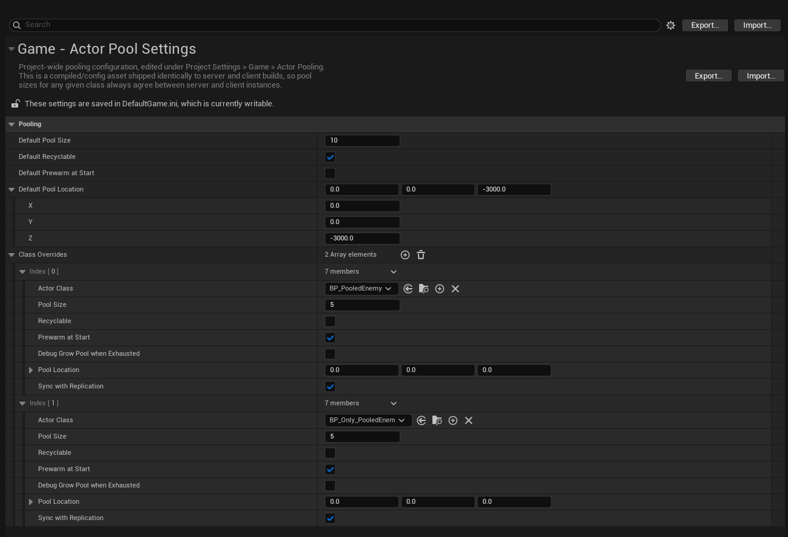
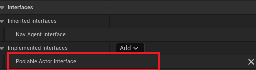
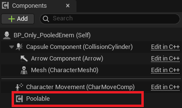
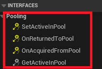
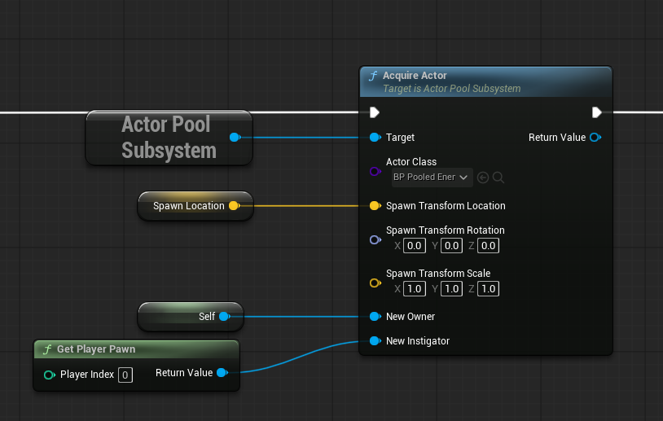
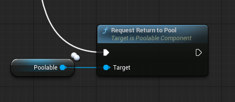
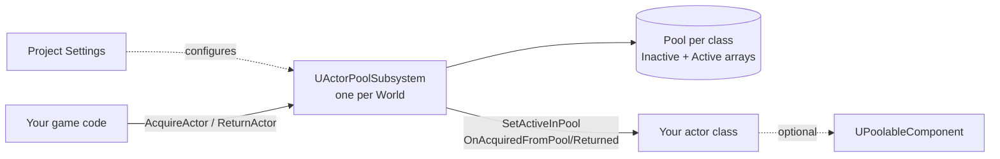
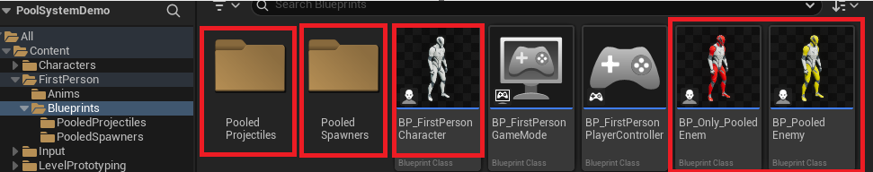

# Actor Pooling

*Copyright (c) 2026 Cody Van De Mark. Licensed under the MIT License. Contact: cody.a.vandemark@gmail.com* / [codyvdm.com](https://codyvdm.com)

A generic actor pooling system for Unreal Engine 5. I built this to cut down on spawn/destroy churn and replication cost in multiplayer games. Any actor class opts in via a Blueprint-implementable interface. There's no base-class requirement unless you want replicated support. Everything gets managed by a single world-scoped subsystem that handles reuse, recycling, net dormancy, and (optionally) keeping a client's own bookkeeping in sync with a server-authoritative replicated pool.

**Specific docs:** 

[Architecture](Docs/Architecture.md) · 
[Data Flow](Docs/DataFlow.md) · 
[API Reference](Docs/API-Reference.md)

---

## Features

- **Usable in CPP or BP based projects** - Interface-based and component-based, not base-class-based — implement `IPoolableActorInterface` in C++ or Blueprint on any existing `AActor` subclass. It is recommended to use the UPoolableComponent for replication. 
- **Recyclable and non-recyclable pools**, configurable per class.
- **World-scoped subsystem** (`UActorPoolSubsystem`) — no manager actor to place, works the same in PIE, standalone, and networked games.
- **Optional convenience component** (`UPoolableComponent`) that gives you default show/hide mechanics and replicated state for free.
- **Replication-aware**: pooled replicated actors are kept net-dormant while inactive, and an opt-in flag keeps a *client's* pool bookkeeping in sync with the server's decisions.
- **Dedicated path for non-replicated cosmetic actors** (e.g. hitscan-adjacent projectiles) via `UPooledProjectileLauncherComponent`, which fans a single server call out to a local acquire on every machine.
- **Batch acquire/return**, a location-scatter helper for spawning a batch without stacking actors on top of each other, per-class debug pool growth, and live pool stats for a debug HUD.
- **Per-class configuration** via Project Settings, with runtime overrides available through `RegisterPoolClass`.

## Requirements

- Unreal Engine 5.x


**No third-party dependencies**. Pure `Core`/`CoreUObject`/`Engine` modules.

## History

I made this to support my work on the game [Tank Goblins](https://store.steampowered.com/app/4353390/Tank_Goblins/). Please wishlist 😄 

We had a scaling problem in multiplayer where too many objects were being spawned with replication. It would cause bursts of actors that would affect the framerate, so I created a pooling system to limit how many assets were allocated. 

I had already created a blueprint system to handle object pooling, but it did not use subsystems and required a manager to be in the map. 

This version was written from the ground up to be an abstracted subsystem that could be used anywhere. I was able to implement better replication support and add a bunch of debug features I was missing in the original version.

Since I made this as a re-usable plugin for my future projects, I figured I'd share it online for others looking for the same system.

## Repo Structure

| Folder | Contents |
|---|---|
| **PoolSystemPlugin** | Contains the actual uplugin that can be added to other Unreal projects. This also contains the plugin source code. |
| **PoolSystemDemo** | This is a sample unreal project using the plugin with C++ and Blueprint examples of implementing the plugin. |
| **Docs** | Extra documentation, API reference and diagrams. | 


## Installation

1. Put the plugin into the `Plugins` folder of your Unreal project. If the `Plugins` folder is missing, then create one.

The `Plugins` folder should at the same level as your `uproject`. The `ActorPooling` folder should be directly under the `Plugins` folder. Inside of the `ActorPooling` folder should be all of the plugin files, such as the `.uplugin` file. 

For example - MyCoolUnrealProject/Plugins/ActorPooling/ActorPooling.uplugin. 

2. Open your `uproject` and make sure the plugin is enabled (Edit -> Plugins).



3. Restart the unreal project to make sure the plugin is loaded.

4. Setup the plugin configuration in the project (Edit -> Project Settings -> Actor Pool Settings). See `Quick Start` section for details.



---

## Core Concepts

Every pooled class falls into one of two modes, set per class via `FPoolClassConfig::bRecyclable`:

| Mode | Behavior when the pool runs out |
|---|---|
| **Recyclable** (default) | The oldest currently-active instance is force-deactivated and reused. `AcquireActor` always returns an actor. |
| **Non-recyclable** | `AcquireActor` returns `nullptr`. Instances only come back via an explicit `ReturnActor` call (or `bDebugGrowPoolWhenExhausted`). |

**Note: Pool size is a hard cap on how many instances of a class ever exist at once**. The point of the plugin is to allocate predictable resources and limit the actor count in a scene instead of spawning/destroying freely.

## Quick Start

### Plugin Settings



| Setting | Description |
|---|---|
| **Default Pool Size** | Default max size of a pool for any specific class. |
| **Default Recyclable** | Whether or not the actors in the pool auto-recycle (first-in-first-out) when the pool is exhausted. |
| **Default Prewarm at Start** | Whether pools are automatically populated at the beginning of the game or use lazy loading when needed. |
| **Default Pool Location** | Location in the world where all actors of the pool are spawned and where they go when inactive/dormant. |
| **Class Overrides** | Options for specific overrides per class. These specify how each pooled class should operate. For example, you might not want a particular class to recycle objects and instead wait until the pool is available again. |
| **Debug Grow Pool when Exhausted** | This is an optional debug parameter that effectively disables the pool system. This essentially turns off pooling and allows the actor to keep spawning new ones indefinitely. The purpose is to allow developers to test without pooling to get an idea of the upper bounds of actors in their scene. I added this in our game to figure out how many projectiles could possibly be in a scene. |


### Blueprint

**1. Implement `PoolableActorInterface`** on your actor. 




**2. Add the Poolable Component** on your actor. This is recommended for replication support, but can be skipped if you are building a custom implementation. 




**3. Implement each part of the poolable interface** on your actor.



**4. Acquire your poolable actor from the pool system** from whichever actor class would spawn your poolable. This could be an enemy spawner, a player spawning a projectile or anywhere that you would traditionally spawn an actor.

***Note:*** _If the poolable actor is replicated, then you'll only want to acquire the actor from the pool on the server only and make sure the actor class is configured to replicate in the poolable settings._



**5. Later, return your pooled actor to the pool** once you are done with it. Any time you want to "destroy" or despawn your actor, just call to return it to the pool. This will disable the actor (disabling tick, collision, replication, etc) and move it to the pool location.

Examples: poolable projectile hits a wall, poolable enemy AI pawn dies, poolable pickup on the ground despawns, etc.

***Note:*** _If the poolable actor is replicated, then this is most likely going to be a server-side check._ 




### C++


**1. Implement `IPoolableActorInterface`** on your actor class (C++ shown; Blueprint works the same via Class Settings > Interfaces):

```cpp
UCLASS()
class AMyPoolableActor : public AActor, public IPoolableActorInterface
{
    GENERATED_BODY()
public:
    virtual void OnAcquiredFromPool_Implementation() override;   // gameplay setup
    virtual void OnReturnedToPool_Implementation() override;     // gameplay teardown
    virtual bool GetActiveInPool_Implementation() const override;
    virtual void SetActiveInPool_Implementation(bool bNewActive) override; // mechanical show/hide
};
```

The easiest way to implement the mechanical half is to add a `UPoolableComponent` and forward to it:

```cpp
void AMyPoolableActor::SetActiveInPool_Implementation(bool bNewActive)
{
    bNewActive ? PoolableComponent->DefaultActivate() : PoolableComponent->DefaultDeactivate();
}
```

**2. (Optional) Configure the class** — either in Project Settings under **Game > Actor Pool Settings**, or at runtime:

```cpp
UActorPoolSubsystem* Pool = GetWorld()->GetSubsystem<UActorPoolSubsystem>();
Pool->RegisterPoolClass(AMyPoolableActor::StaticClass(), /*PoolSize=*/20, /*bRecyclable=*/true);
```

If you never call `RegisterPoolClass`, the class falls back to the defaults in Project Settings the first time it's used.

**3. Acquire and return:**

```cpp
AActor* Spawned = Pool->AcquireActor(AMyPoolableActor::StaticClass(), SpawnTransform);
// ... later ...
Pool->ReturnActor(Spawned);
```

That's the whole contract. See [Docs/API-Reference.md](Docs/API-Reference.md) for the full function list (batch variants, `GetPoolStats`, `GetLocationVariance`, etc.), and the two example classes shipped with the plugin for complete, working templates:

- `AExamplePoolableEnemyPawn` — a **replicated** pooled actor (health, AI, server-authoritative).
- `AExamplePoolableProjectile` — a **non-replicated** pooled actor fired through `UPooledProjectileLauncherComponent`.

## At a Glance



For the full component map and every data-flow sequence (acquire, return, force-recycle, replication sync, non-replicated projectile fan-out), see [Docs/Architecture.md](Docs/Architecture.md) and [Docs/DataFlow.md](Docs/DataFlow.md).

## Example Project

I have provided a small example project called PoolSystemDemo. It is a full Unreal project implementing the plugin with a playable sample scene.

There are examples of use for both 
- cpp implementation of actors using the system
- blueprint implementation of actors using the system

### Files



| Files | Description |
|---|---|
| **BP_FirstPersonCharacter** | Main player character for each player. Inputs setup so left click spawns `BP_CPP_PooledProjectile` (C++ based) and right click spawns `BP_Only_PooledProjectile` (BP based). |
| **BP_Pooled_Enemy** | Pooled enemy based on the CPP class `ExamplePoolableEnemyPawn`. This BP is basically just the C++ example class with a static mesh attached. Spawned by `BP_CPPEnemySpawnerTrigger`. This actor is NOT set to recycle. |
| **BP_Only_PooledEnemy** | Pooled enemy built in blueprints. Same functionality as `BP_Pooled_Enemy` but implemented in blueprints. Poolable implementation and logic implemented in blueprint. Spawned by `BP_EnemySpawnerTrigger`. This actor is NOT set not to recycle. |
| **PooledProjectiles/BP_CPP_PooledProjectile** | Pooled projectile based on CPP class `ExamplePooledProjectile`. This is basically just the C++ example class with a static mesh attached. Spawned by `BP_FirstPersonCharacter`. This actor IS set to recycle. |
| **PooledProjectiles/BP_Only_PooledProjectile** | Pooled projectile built in blueprint. Same functionality as `BP_CPP_PooledProjectile` but implemented in blueprints. Poolable implementation and logic implemented in blueprints. Spawned by `BP_FirstPersonCharacter`. This actor IS set to recycle. |
| **PooledSpawners/BP_CPPEnemySpawnerTrigger** | Trigger volume to spawn `BP_Pooled_Enemy`. Enemy actors are configured in the example project settings not to recycle so it will limit to 5 at a time. |
| **PooledSpawners/BP_EnemySpawnerTrigger**  | Trigger volume to spawn `BP_Only_Pooled_Enemy`. Enemy actors are configured in the example project settings not to recycle so it will limit to 5 at a time. | 

### Example Project Plugin Settings


Pool settings in this project are setup so that the enemy classes `BP_PooledEnemy` / `BP_Only_PooledEnemy` are limited `5` actors of each in the scene and set to non-recyclable. 

This means that after all of the actors of one of the particular classes are active, no more can be spawned until others are returned to the pool.

The projectiles use default settings so they are limited to `10` and are recyclable. Once all of the actors of one of hte particular projectile classes are active, every time a new one is "spawned", the oldest active one will "despawn" recycling back into the pool and activating as a new projectile automatically. 

## Known Limitations

**Replication**:
- **Replication only supported out of the box by using the UPoolableComponent** - **`bSyncWithReplication`** only tracks actors that use `UPoolableComponent`'s replicated flag. A fully custom `IPoolableActorInterface` implementation without that component won't be tracked for replication.

- **No built-in authority gating** on `AcquireActor`/`RegisterPoolClass`/`PrewarmPool` — for a replicated class, it's the caller's responsibility to only invoke these on the server (see `AExamplePoolableEnemyPawn`'s class comment). `ReturnActor`'s Blueprint entry point (`UPoolableComponent::RequestReturnToPool`) does enforce this.

<br>

**Subsystem**:

- **Recycling is FIFO by acquisition order**, not by relevance — the *oldest-acquired* active instance is always the one force-recycled, regardless of whether it's still important to gameplay.

- **A synced pool's `MaxPoolSize`** won't reflect server-side runtime growth from `bDebugGrowPoolWhenExhausted`, since that growth is local to the server and never replicates.

- **Owner/Instigator are not cleared** when an actor returns to the pool — an inactive instance keeps whatever Owner/Instigator it last had until the next `Acquire` overwrites them.

## Support

As per the license, this plugin is provided AS-IS. It has no warranty or guarantee of support. For questions, you can reach out to me, but I cannot guarantee any availability. 
